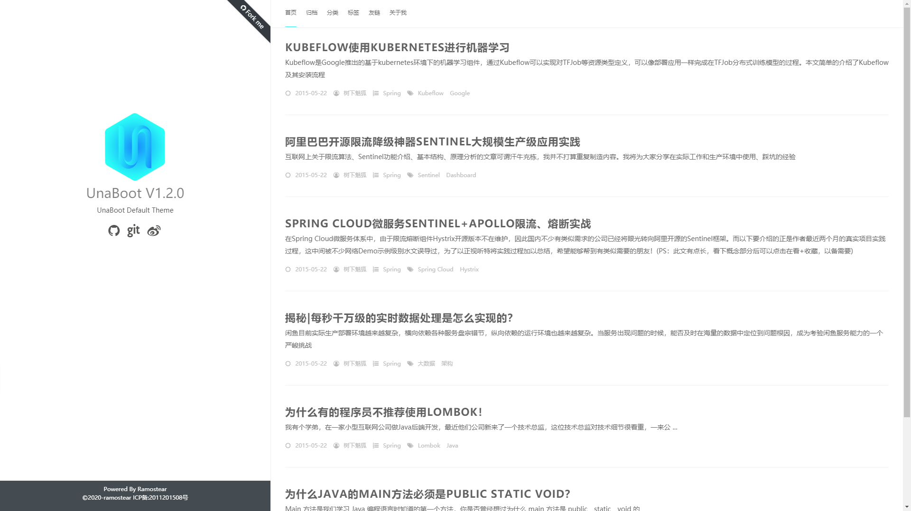
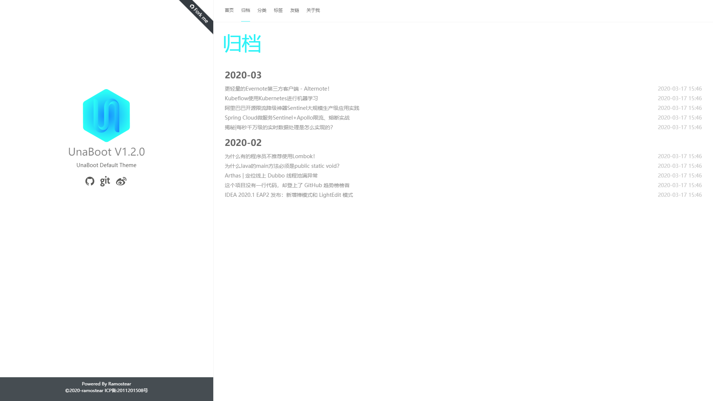
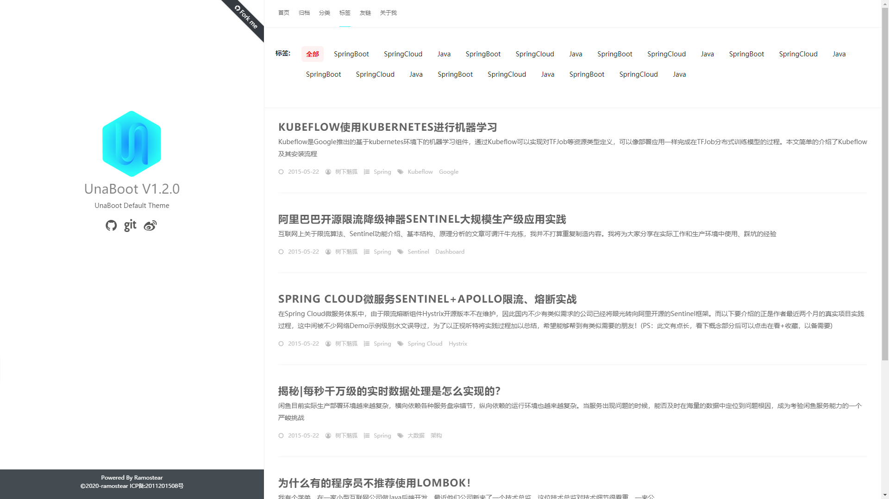
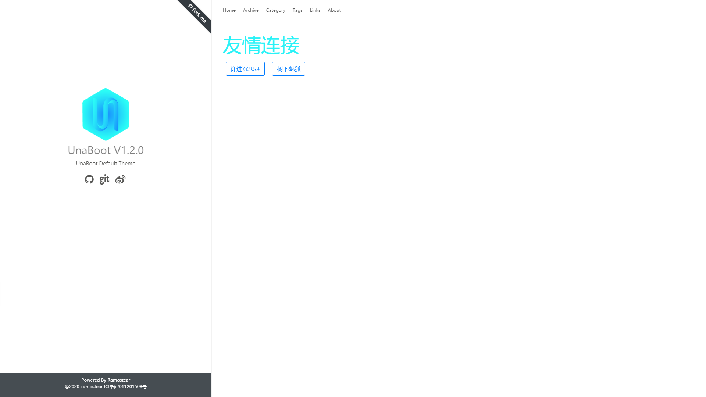
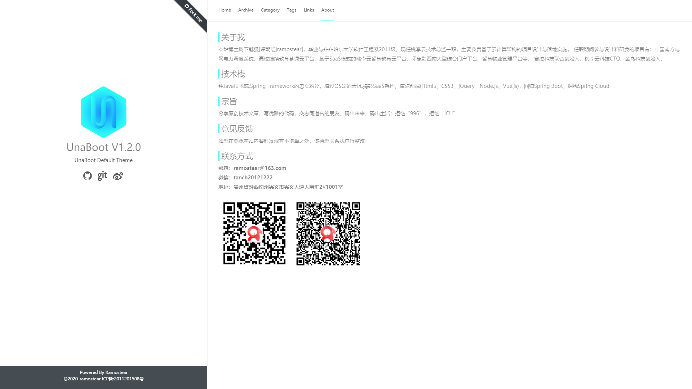
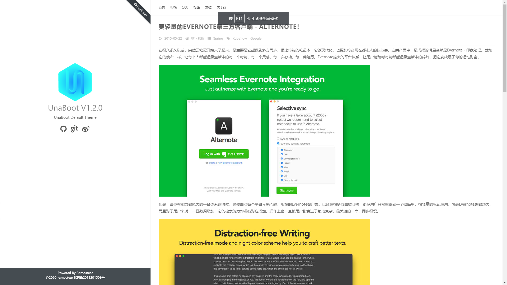

# UnaBoot-Theme-Catalina
尤娜博客系统默认主题

UnaBoot-Theme-Catalina是参考[hexo-theme-Anatole](https://github.com/Ben02/hexo-theme-Anatole)主题布局，
使用BootStrap 4编写的尤娜博客主题。
至于为什么叫Catalina这个名字，我在写的时候没有特意安排，刚好在Tomcat中部署项目，所以就用了Tomcat中Catalina文件夹的名字。
下面是主题界面的预览。
1.博客主页

2.文章归档

3.文章分类

4.文章标签

5.友链

6.About页面

7.文章详情页面
